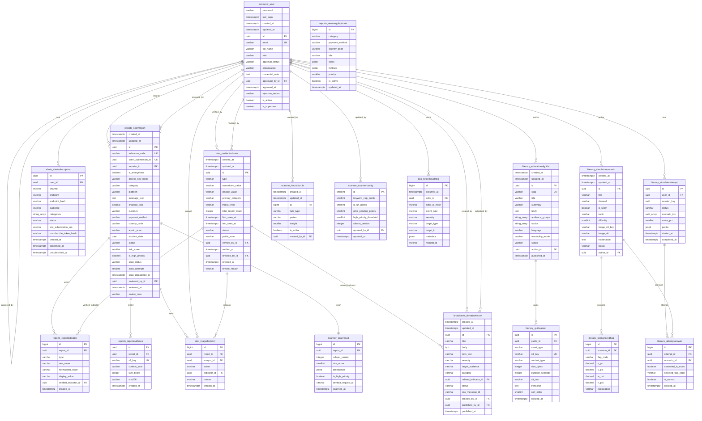

# ScamShield Cloud — Database Entity-Relationship Diagram

Total app tables: 19

> Generated from Django models via `backend/tools/generate_erd.py`.

```mermaid
erDiagram
    accounts_user ||--o{ accounts_user : "approved_by"
    accounts_user ||--o{ reports_scamreport : "reporter"
    accounts_user ||--o{ reports_scamreport : "reviewed_by"
    reports_scamreport ||--o{ reports_reportindicator : "report"
    intel_verifiedindicator ||--o{ reports_reportindicator : "verified_indicator"
    reports_scamreport ||--o{ reports_reportevidence : "report"
    accounts_user ||--o{ intel_verifiedindicator : "verified_by"
    accounts_user ||--o{ intel_verifiedindicator : "revoked_by"
    reports_scamreport ||--o{ intel_triagedecision : "report"
    accounts_user ||--o{ intel_triagedecision : "analyst"
    intel_verifiedindicator ||--o{ intel_triagedecision : "indicator"
    accounts_user ||--o{ alerts_alertsubscription : "user"
    intel_verifiedindicator ||--o{ broadcasts_threatadvisory : "related_indicator"
    accounts_user ||--o{ broadcasts_threatadvisory : "created_by"
    accounts_user ||--o{ broadcasts_threatadvisory : "published_by"
    accounts_user ||--o{ literacy_educationalguide : "author"
    literacy_educationalguide ||--o{ literacy_guideasset : "guide"
    accounts_user ||--o{ literacy_simulatorscenario : "author"
    literacy_simulatorscenario ||--o{ literacy_scenarioredflag : "scenario"
    accounts_user ||--o{ literacy_simulatorattempt : "user"
    literacy_simulatorattempt ||--o{ literacy_attemptanswer : "attempt"
    literacy_simulatorscenario ||--o{ literacy_attemptanswer : "scenario"
    accounts_user ||--o{ scanner_heuristicrule : "created_by"
    accounts_user ||--o{ scanner_scannerconfig : "updated_by"
    reports_scamreport ||--|| scanner_scanresult : "report"
    accounts_user ||--o{ ops_systemauditlog : "actor"

    accounts_user {
        varchar password
        timestamptz last_login
        timestamptz created_at
        timestamptz updated_at
        uuid id PK
        varchar email UK
        varchar full_name
        varchar role
        varchar approval_status
        varchar organization
        text credential_note
        uuid approved_by_id FK
        timestamptz approved_at
        varchar rejection_reason
        boolean is_active
        boolean is_superuser
    }
    reports_scamreport {
        timestamptz created_at
        timestamptz updated_at
        uuid id PK
        varchar reference_code UK
        uuid client_submission_id UK
        uuid reporter_id FK
        boolean is_anonymous
        varchar access_key_hash
        varchar category
        varchar platform
        text message_text
        decimal financial_loss
        varchar currency
        varchar payment_method
        varchar country_code
        varchar admin_area
        date incident_date
        varchar status
        smallint risk_score
        boolean is_high_priority
        varchar scan_status
        smallint scan_attempts
        timestamptz scan_dispatched_at
        uuid reviewed_by_id FK
        timestamptz reviewed_at
        varchar review_note
    }
    reports_reportindicator {
        bigint id PK
        uuid report_id FK
        varchar type
        varchar raw_value
        varchar normalized_value
        varchar display_value
        uuid verified_indicator_id FK
        timestamptz created_at
    }
    reports_reportevidence {
        uuid id PK
        uuid report_id FK
        varchar s3_key UK
        varchar content_type
        integer size_bytes
        varchar sha256
        timestamptz created_at
    }
    reports_recoveryplaybook {
        bigint id PK
        varchar category
        varchar payment_method
        varchar country_code
        varchar title
        jsonb steps
        jsonb hotlines
        smallint priority
        boolean is_active
        timestamptz updated_at
    }
    intel_verifiedindicator {
        timestamptz created_at
        timestamptz updated_at
        uuid id PK
        varchar type
        varchar normalized_value
        varchar display_value
        varchar primary_category
        varchar threat_level
        integer total_report_count
        timestamptz first_seen_at
        timestamptz last_seen_at
        varchar status
        varchar public_note
        uuid verified_by_id FK
        timestamptz verified_at
        uuid revoked_by_id FK
        timestamptz revoked_at
        varchar revoke_reason
    }
    intel_triagedecision {
        bigint id PK
        uuid report_id FK
        uuid analyst_id FK
        varchar action
        uuid indicator_id FK
        varchar reason
        timestamptz created_at
    }
    alerts_alertsubscription {
        uuid id PK
        uuid user_id FK
        varchar channel
        varchar endpoint
        varchar endpoint_hash
        varchar audience
        string_array categories
        varchar status
        varchar sns_subscription_arn
        varchar unsubscribe_token_hash
        timestamptz created_at
        timestamptz confirmed_at
        timestamptz unsubscribed_at
    }
    broadcasts_threatadvisory {
        timestamptz created_at
        timestamptz updated_at
        uuid id PK
        varchar title
        text body
        varchar sms_text
        varchar severity
        varchar target_audience
        varchar category
        uuid related_indicator_id FK
        varchar status
        varchar sns_message_id
        uuid created_by_id FK
        uuid published_by_id FK
        timestamptz published_at
    }
    literacy_educationalguide {
        timestamptz created_at
        timestamptz updated_at
        uuid id PK
        varchar slug UK
        varchar title
        varchar summary
        text body
        string_array audience_groups
        string_array tactics
        varchar language
        varchar readability_mode
        varchar status
        uuid author_id FK
        timestamptz published_at
    }
    literacy_guideasset {
        uuid id PK
        uuid guide_id FK
        varchar asset_type
        varchar s3_key UK
        varchar content_type
        integer size_bytes
        integer duration_seconds
        varchar alt_text
        text transcript
        smallint sort_order
        timestamptz created_at
    }
    literacy_simulatorscenario {
        timestamptz created_at
        timestamptz updated_at
        uuid id PK
        varchar title
        varchar channel
        boolean is_scam
        varchar tactic
        smallint difficulty
        varchar image_s3_key
        varchar image_alt
        text explanation
        varchar status
        uuid author_id FK
    }
    literacy_scenarioredflag {
        bigint id PK
        uuid scenario_id FK
        varchar flag_code
        decimal x_pct
        decimal y_pct
        decimal w_pct
        decimal h_pct
        varchar explanation
    }
    literacy_simulatorattempt {
        uuid id PK
        uuid user_id FK
        uuid session_key
        varchar status
        uuid_array scenario_ids
        smallint score_pct
        jsonb profile
        timestamptz started_at
        timestamptz completed_at
    }
    literacy_attemptanswer {
        bigint id PK
        uuid attempt_id FK
        uuid scenario_id FK
        boolean answered_is_scam
        varchar selected_flag_code
        boolean is_correct
        timestamptz created_at
    }
    scanner_heuristicrule {
        timestamptz created_at
        timestamptz updated_at
        bigint id PK
        varchar rule_type
        varchar pattern
        smallint weight
        boolean is_active
        uuid created_by_id FK
    }
    scanner_scannerconfig {
        smallint id PK
        smallint keyword_cap_points
        smallint ip_url_points
        smallint prior_pending_points
        smallint high_priority_threshold
        integer ruleset_version
        uuid updated_by_id FK
        timestamptz updated_at
    }
    scanner_scanresult {
        bigint id PK
        uuid report_id FK
        integer ruleset_version
        smallint risk_score
        jsonb breakdown
        boolean is_high_priority
        varchar lambda_request_id
        timestamptz scanned_at
    }
    ops_systemauditlog {
        bigint id PK
        timestamptz occurred_at
        uuid actor_id FK
        varchar actor_ip_hash
        varchar event_type
        varchar severity
        varchar target_type
        varchar target_id
        jsonb metadata
        varchar request_id
    }
```
